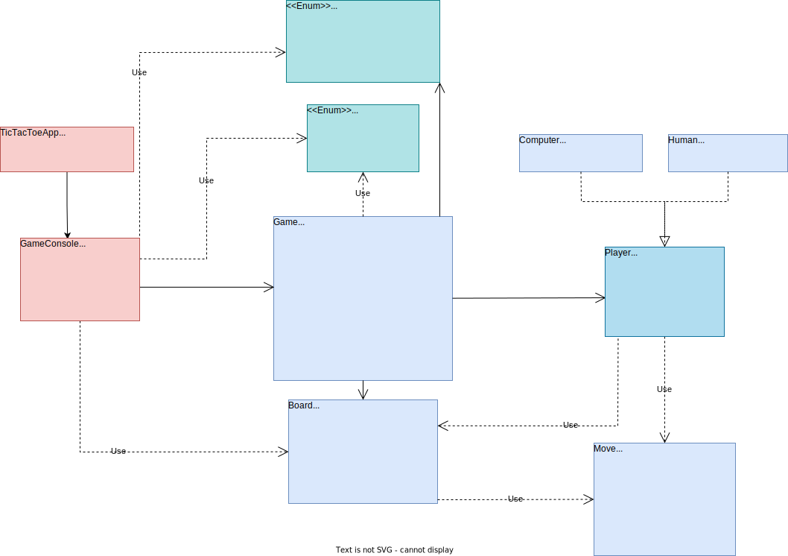
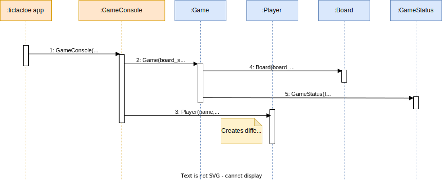

# Tic Tac Toe

1. [Description](#1-description)
2. [Design](#2-design)
3. [Build & Execute](#3-build--execute)

---
## 1. Description
The objective of this project is to learn various disciplines involved in the development of the Tic Tac Toe game as a C++ application. Importance is given to the usage of UML during design rather than the code quality. Nevertheless, suggestions & improvements are always welcome.

Areas of improvement
- Class restructuring
- Coding
- UML diagrams

> Inspired by http://www.cs.mun.ca/~av/courses/5895-current/?page_id=24 

## 2. Design

> These diagrams are editable with draw.io

### Class Diagram


### Sequence Diagram
#### Object creation


## 3. Build & Execute
```
mkdir build
cd build
cmake ..
cmake --build .
.\Debug\tictactoe.exe